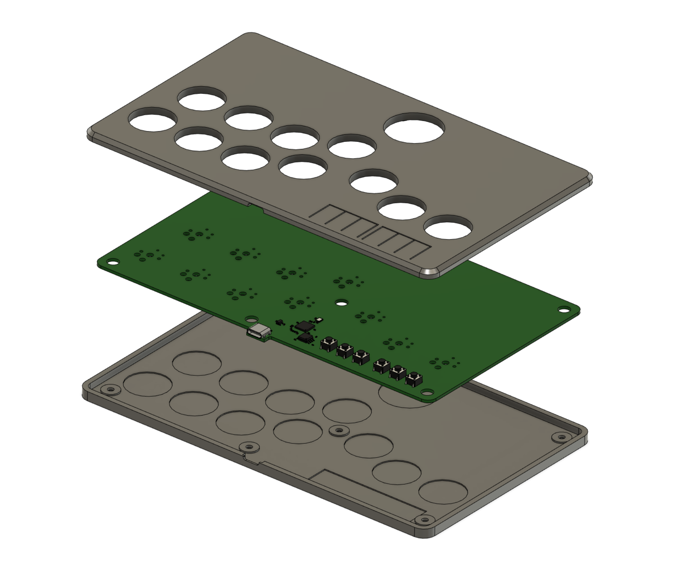

# Flatbox rev4

This is rev4 of the Flatbox with RBG added for each button. In this version the PCB includes a microcontroller and USB port. Everything is built in, you only have to add the switches (and flash the firmware).

To make one you will need:

* [3D printed case parts](3d-printed-case) - top and bottom
* [the PCB](pcb)
* 12x Kailh low profile (choc v1) switches of your choice
* (optionally) 12x Kailh low profile hotswap sockets
* [3D printed buttoncaps](../3d-printed-buttoncaps)
* 6x 6x6x5mm tact switches
* 7x 3x10mm wood screws
* some kind of rubber feet or non-slip padding for the bottom
* a soldering iron

I printed the case at 0.20mm layer height. The top part should be printed upside-down, the bottom part should be printed as-is. They don't require supports.

I used [JLCPCB](https://jlcpcb.com/) to make the PCB and assemble the SMD parts. The [included files](pcb) can be used with JLCPCB directly. If you want to use some other service, check the file formats that they expect. When ordering from JLCPCB, upload the Gerber zip, leave all the settings at default (you can choose the PCB color), then select "SMT Assembly" and upload the BOM and CPL files. PCB thickness should be 1.6mm.

The PCB you get from JLCPCB will look like this:

For this version you must use hotswap sockets to connect the switches to the board

You don't have to use the [code](../firmware-rp2040) included here, you can use any other RP2040-compatible firmware. The included firmware works with the PS3 and PC.

To flash the firmware, connect the PCB to a computer with a USB cable, then press the RESET button while holding the BOOT button on the PCB. A drive named "RPI-RP2" should appear. Copy the [flatbox-rev4.uf2](firmware/flatbox-rev4.uf2) file to that drive. That's it.

PCB design licensed under [CC BY-SA 4.0](https://creativecommons.org/licenses/by-sa/4.0/).

PCB design uses the following libraries:

* [keyswitches.pretty](https://github.com/daprice/keyswitches.pretty) by [daprice](https://github.com/daprice) ([CC BY-SA 4.0](https://creativecommons.org/licenses/by-sa/4.0/))
* [Type-C.pretty](https://github.com/ai03-2725/Type-C.pretty) by [ai03-2725](https://github.com/ai03-2725)
* RP2040 library from the [minimal design example](https://datasheets.raspberrypi.org/rp2040/Minimal-KiCAD.zip) from the [Hardware design with RP2040](https://datasheets.raspberrypi.org/rp2040/hardware-design-with-rp2040.pdf) document
